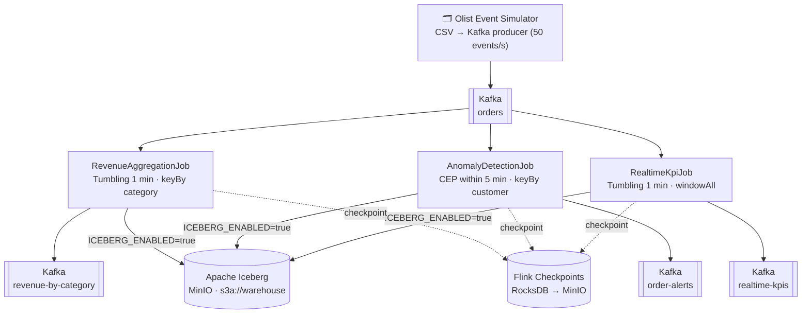
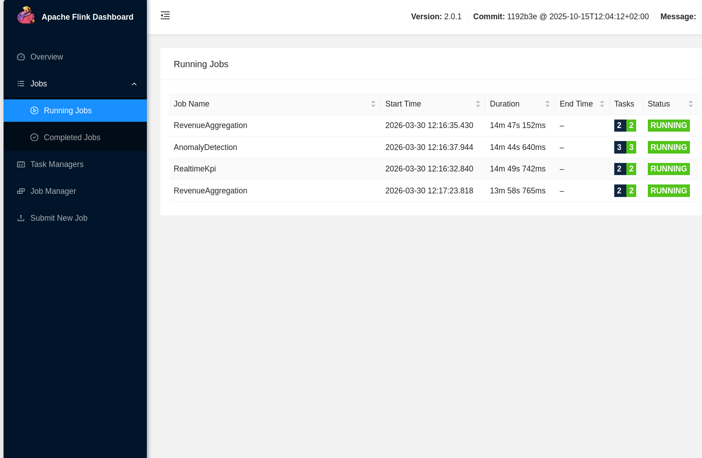
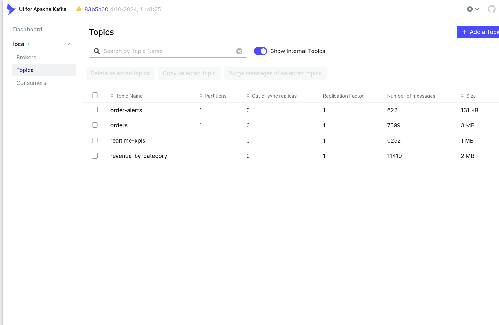
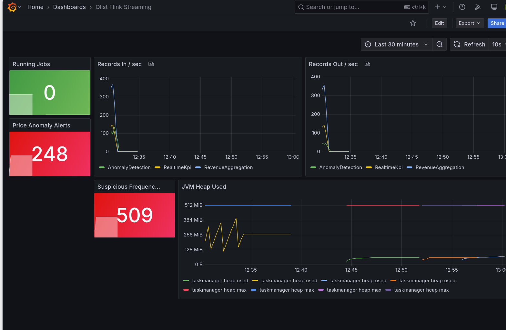
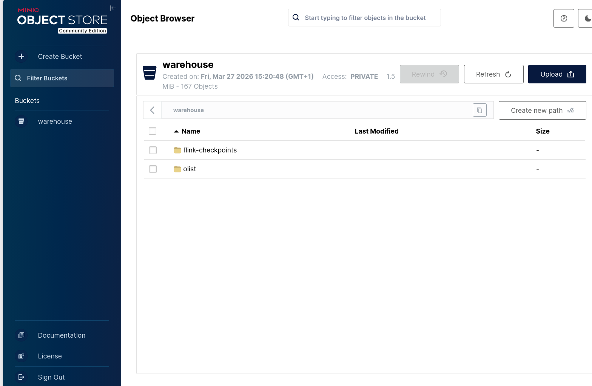

# olist-flink-streaming

[](https://github.com/HamdiMechelloukh/olist-flink-streaming/actions/workflows/ci.yml)

Real-time e-commerce analytics pipeline using Apache Flink, Kafka, and Iceberg, built on the [Olist Brazilian E-Commerce dataset](https://www.kaggle.com/datasets/olistbr/brazilian-ecommerce).

## Architecture



## Jobs

| Job | Description | Window |
|-----|-------------|--------|
| **RevenueAggregationJob** | Revenue per product category | Tumbling 1 min |
| **AnomalyDetectionJob** | CEP: suspicious order frequency + price anomalies | CEP within 5 min |
| **RealtimeKpiJob** | Average order value, orders/min, total revenue | Tumbling 1 min (global) |

## CEP Patterns

- **Suspicious Frequency**: 3+ orders from same customer within 5 minutes
- **Price Anomaly**: Order price exceeding threshold (> 500 BRL)

## Prerequisites

- Java 21
- Docker & Docker Compose
- Gradle (or use `./gradlew`)

## Configuration

Copy `.env.example` and adjust as needed:

```bash
cp .env.example .env
```

> **Note**: `MINIO_ROOT_USER` and `MINIO_ROOT_PASSWORD` are set to insecure defaults in `.env.example`. Change them before any non-local deployment.

| Variable | Default | Description |
|----------|---------|-------------|
| `KAFKA_BOOTSTRAP_SERVERS` | `localhost:9092` | Kafka broker address |
| `CHECKPOINT_INTERVAL_MS` | `30000` | Flink checkpoint interval in milliseconds |
| `ICEBERG_ENABLED` | `false` | Enable Iceberg sink on all jobs |
| `ICEBERG_CATALOG_URI` | `http://localhost:8181` | Iceberg REST catalog URL |
| `ICEBERG_WAREHOUSE` | `s3a://warehouse/` | Iceberg warehouse path |
| `ICEBERG_CATALOG_NAME` | `olist_catalog` | Iceberg REST catalog name |
| `MINIO_ROOT_USER` | `admin` | MinIO / S3 access key |
| `MINIO_ROOT_PASSWORD` | `password123` | MinIO / S3 secret key |
| `MINIO_ENDPOINT` | `http://localhost:9000` | MinIO endpoint |
| `OLIST_DATA_PATH` | `./data/` | Path to Olist CSV files |
| `EVENTS_PER_SECOND` | `50` | Simulator event throughput |
| `ORDERS_TOPIC` | `orders` | Kafka source topic for all jobs |
| `REVENUE_SINK_TOPIC` | `revenue-by-category` | Output topic for RevenueAggregationJob |
| `ALERTS_SINK_TOPIC` | `order-alerts` | Output topic for AnomalyDetectionJob |
| `KPI_SINK_TOPIC` | `realtime-kpis` | Output topic for RealtimeKpiJob |
| `SUSPICIOUS_ORDER_COUNT` | `3` | Min orders within 5 min to trigger a frequency alert |
| `PRICE_ANOMALY_THRESHOLD` | `500` | Order price (BRL) above which a price alert is fired |

## Quick Start (E2E)

The easiest way to see the pipeline in action is to use the provided E2E script. This will start the infrastructure, build the JAR, submit the jobs to the Flink cluster, and start the event simulator.

```bash
# 1. Clone the repository and copy .env
cp .env.example .env

# 2. Run the E2E script (requires Docker and Java 21)
./scripts/start-e2e.sh
```

## Screenshots

### Flink — 3 jobs RUNNING


### Kafka — topics with live data


### Grafana — real-time metrics


### MinIO — Iceberg warehouse



## UI Access

Once the pipeline is running, you can access the following UIs:

| UI | URL | Description |
|----|-----|-------------|
| **Flink Web UI** | [http://localhost:8081](http://localhost:8081) | Job graph, task metrics, and checkpoints. |
| **Kafka UI** | [http://localhost:8080](http://localhost:8080) | Inspect messages in Kafka topics. |
| **Grafana** | [http://localhost:3001](http://localhost:3001) | Real-time dashboards (Admin: `admin`/`admin`). |
| **MinIO Console** | [http://localhost:9001](http://localhost:9001) | S3-compatible storage for Iceberg and checkpoints. |
| **Prometheus** | [http://localhost:9090](http://localhost:9090) | Raw metric queries. |

## Manual Operations

If you prefer to run steps manually:

### 1. Infrastructure
```bash
docker compose -f docker/docker-compose.yml up -d
```

### 2. Build and Submit
```bash
./gradlew clean shadowJar
docker cp build/libs/olist-flink-streaming-1.0-SNAPSHOT.jar docker-jobmanager-1:/tmp/job.jar
docker exec -d docker-jobmanager-1 flink run -c com.olist.streaming.jobs.RevenueAggregationJob /tmp/job.jar
```

### 3. Run Simulator (Host)
```bash
export $(grep -v '^#' .env | xargs)
java -cp build/libs/olist-flink-streaming-1.0-SNAPSHOT.jar com.olist.streaming.simulator.OlistEventSimulator
```

## Testing

```bash
./gradlew test
```

Tests use Flink MiniCluster (no external infrastructure needed).

## Iceberg Sink

The Iceberg sink is optional, controlled by `ICEBERG_ENABLED=true`. When enabled, Flink jobs write results to Iceberg tables stored in MinIO (S3-compatible).

Initialize tables before first run (handled automatically by `start-e2e.sh`):

```bash
docker exec docker-jobmanager-1 flink run -c com.olist.streaming.sinks.IcebergTableInitializer /tmp/job.jar
```

Tables created: `olist.revenue_by_category`, `olist.realtime_kpis`, `olist.order_alerts`. The `revenue_by_category` table is partitioned by day on `window_start`, reducing scan cost for time-range queries.

### Why Iceberg over Delta Lake?

Delta Lake was considered but not retained for this project:

- **No Flink 2.0 connector**: Delta Lake's Flink connector (`delta-flink`) only supports Flink 1.x. No artifact exists for Flink 2.0 as of March 2026.
- **Iceberg has native Flink support**: `iceberg-flink-runtime-2.0` is officially maintained and published to Maven Central.
- **REST catalog**: Iceberg offers a standard REST catalog spec, making local setup with Docker straightforward (no dependency on Databricks Unity Catalog).
- **Broader engine compatibility**: Iceberg tables can be queried by Spark, Trino, Presto, and Flink without vendor lock-in.

## Observability

Each job exposes custom Flink metrics visible in the Flink Web UI under Task Metrics:

| Metric | Job | Description |
|--------|-----|-------------|
| `windowsEmitted` | RevenueAggregationJob | Number of revenue windows produced |
| `kpiWindowsEmitted` | RealtimeKpiJob | Number of KPI windows produced |
| `priceAnomalyAlertsEmitted` | AnomalyDetectionJob | Price anomaly alerts fired |
| `suspiciousFrequencyAlertsEmitted` | AnomalyDetectionJob | Suspicious frequency alerts fired |

## Design Notes

- **`RealtimeKpiJob` uses `windowAll`**: global KPIs (total orders, total revenue) require aggregating across all partitions. `windowAll` is intentional here — the single-partition bottleneck is acceptable at this scale. For higher throughput, a two-phase aggregation (pre-aggregate per key, then merge) would be needed.

## Known Limitations & Future Work

- **State TTL**: The current CEP patterns use `within()` for time-bounding, which is sufficient here. If `KeyedProcessFunction` with manual state were introduced (e.g., for deduplication or enrichment), explicit [State TTL](https://nightlies.apache.org/flink/flink-docs-master/docs/dev/datastream/fault-tolerance/state/#state-time-to-live-ttl) configuration would be required to prevent unbounded state growth.
- **Schema Registry**: Events are currently serialized as JSON without schema enforcement. In a production pipeline, using a [Confluent Schema Registry](https://docs.confluent.io/platform/current/schema-registry/index.html) with Avro or Protobuf would add schema evolution guarantees and catch producer/consumer contract mismatches before they reach the stream processor.
- **Simulator tests**: The `OlistEventSimulator` is not covered by unit tests as it requires external CSV files and a Kafka broker. It is validated by the end-to-end run.

## Stack

- **Apache Flink 2.0** — stream processing
- **Apache Kafka** — event streaming
- **Apache Iceberg** — analytics table format
- **MinIO** — S3-compatible object storage
- **Java 21** — language
- **Gradle** — build tool
- **JUnit 5 + Flink MiniCluster** — testing
